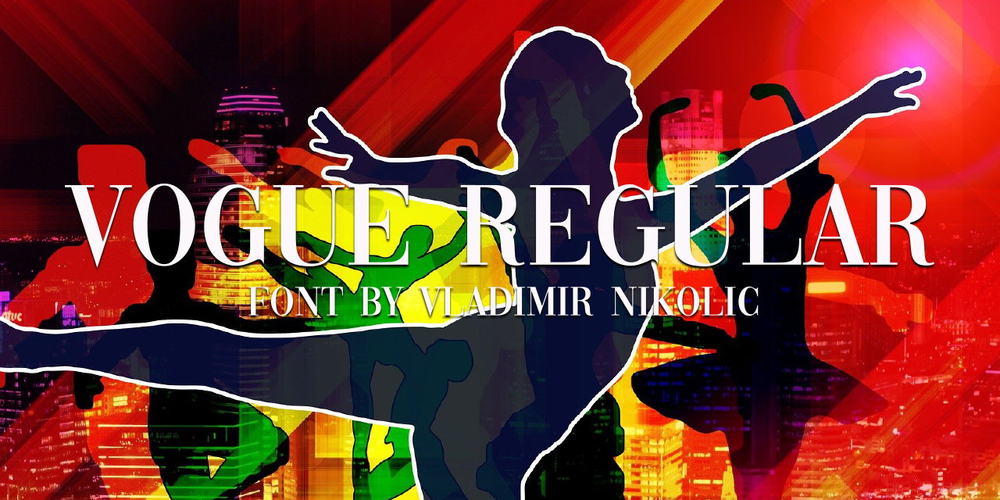
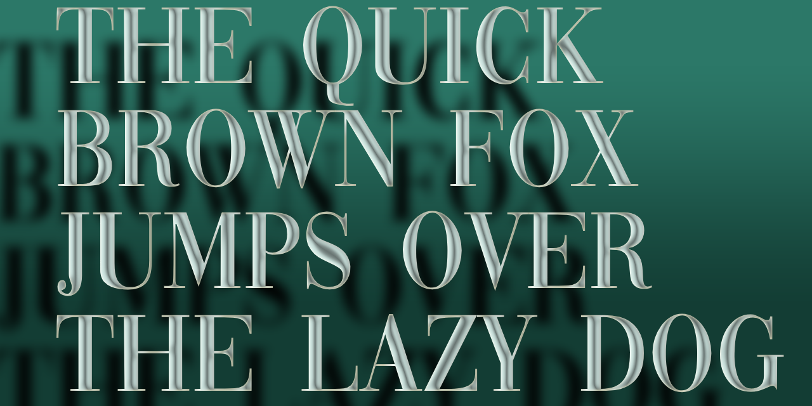

# Vogue Regular

Vogue is a dance to music in such a way as to imitate the characteristic poses struck by a model on a catwalk.

## Variable Font Axe

Vogue Regular has the following axe:

Axis | Tag | Default | Static Instances
--- | --- | --- | ---
Weight | wght | 400 | Regular

Copyright 2018 Vogue Regular Project Authors (https://github.com/vladimirnikolic1/Vogue./) 

This Font Software is licensed under the SIL Open Font License, Version 1.1.
This license is copied below, and is also available with a FAQ at:
https://openfontlicense.org
