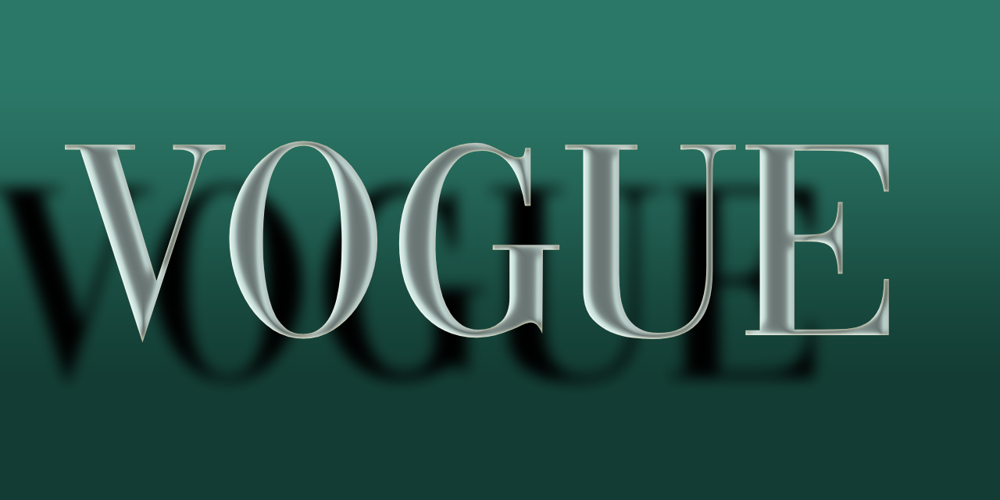

# Vogue

Vogue is a dance to music in such a way as to imitate the characteristic poses struck by a model on a catwalk.

## Variable Font Axe

Vogue has the following axe:

Axis | Tag | Default | Static Instances
--- | --- | --- | ---
Weight | wght | 400 | Regular

